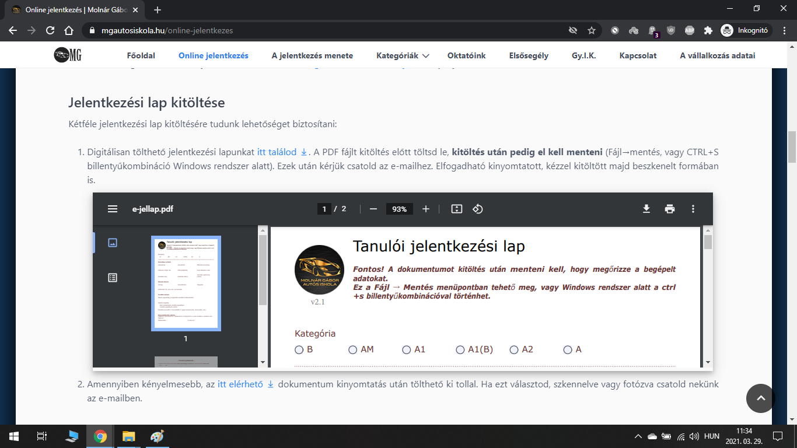
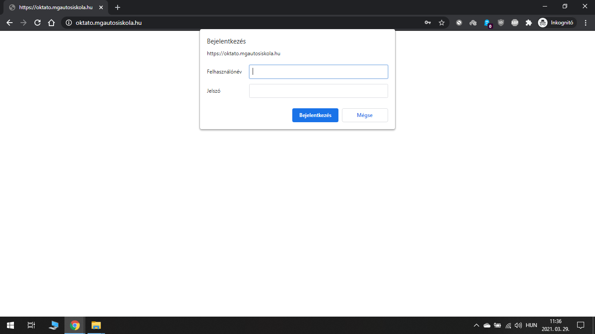
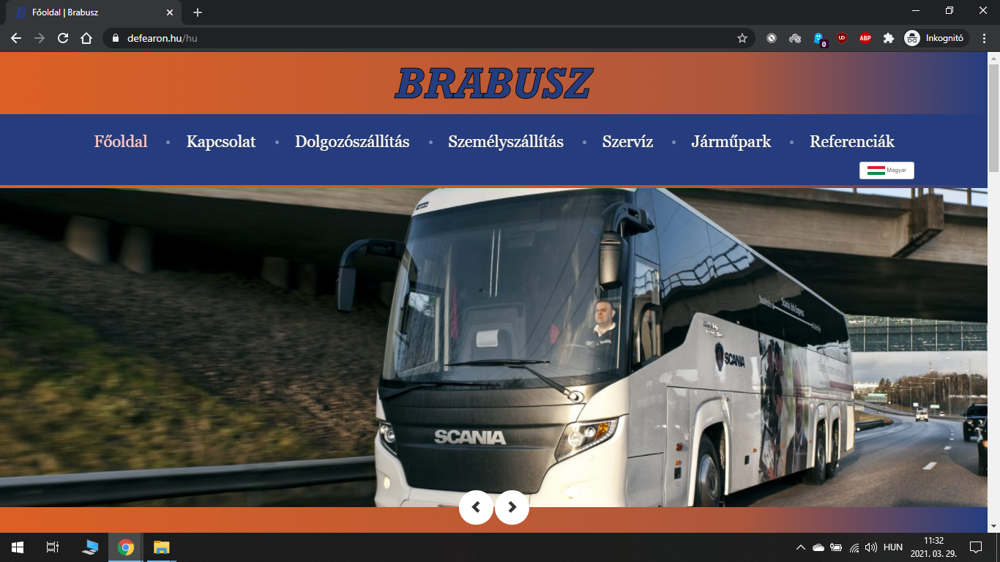
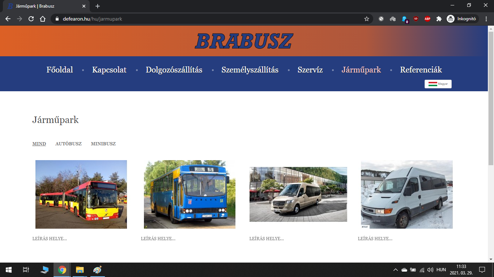
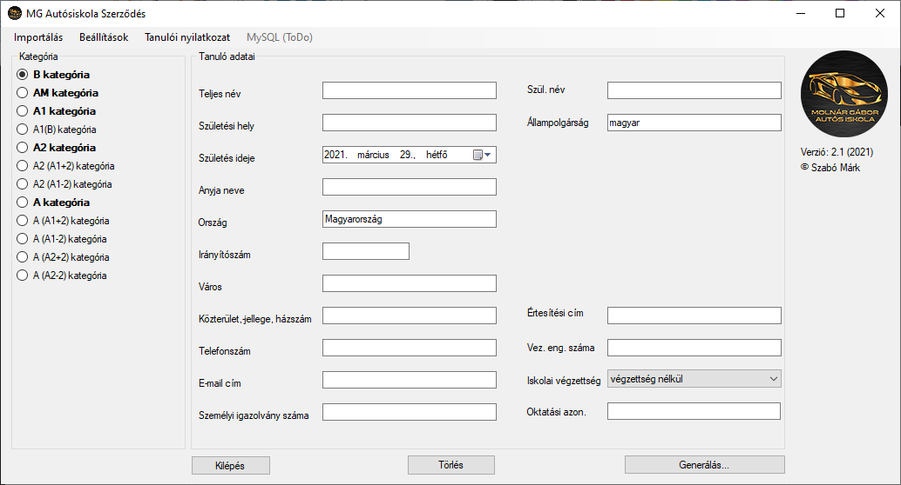
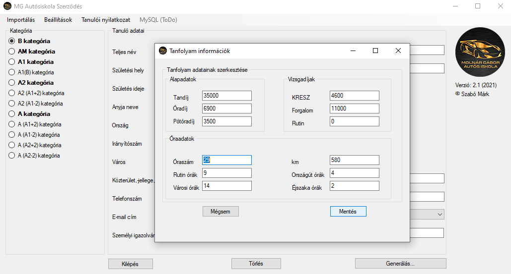

#Webfejlesztés // Programozás
Saját, céges, vállalkozói, blog stb. weboldalak készítésével kapcsolatban kérem érdeklődjön az alábbi elérhetőségek valamelyikén.

###Kapcsolat
#####Szabó Márk
#####E-mail: [markusz996@gmail.com](mailto:markusz996@gmail.com)
#####Tel.: [+36 (30) 47-32-854](tel:+36304732854)  
 
##Referenciák  

### Molnár Gábor Autósiskola publikus weboldala
Megtekintés az interneten: [www.mgautosiskola.hu](www.mgautosiskola.hu)  

###Funkcionalitás
1. Blog-felület hírek, információk közzétételére
2. Információgazdag tartalom, amely segítséget nyújt szinte minden kérdésben
3. Online jelentkezési rendszer kialakítása és menedzselése
4. Stílusos, modern animációk, logók

####Galéria
[gallery margins=35 lastRow="justify" closeOnOutsideClick="true"]

[/gallery]

### Molnár Gábor Autósiskola privát, oktatói felülete
Megtekintés az interneten: ×  

###Funkcionalitás
1. MySQL adatbázis fejlesztése tanulói adatok nyilvántartására
2. Az adatbázis tartalma alapján dinamikusan generált felület
3. Lehetőség e-mail értesítések automatikus vagy manuális küldésére a munkatársak e-mail címére
4. Az adatbázis vizuális reprezentációja, keresés az adatokban
5. Lehetőség többfelhasználós bejelentkezésre
6. Felhasználói jogosultságok tükrében bizonyos jogkörök (pl.: mappák és fájlok létrehozása, olvasása, írása stb.)
7. XML struktúrájú fájlok importálása a MySQL adatbázisba
8. Nagyon egyszerű, letisztult, Bootstrap-alapú megjelenés  

####Galéria
[gallery margins=35 lastRow="justify" closeOnOutsideClick="true"]

[/gallery]

### BRABUSZ Kft. weboldal
Megtekintés az interneten: [www.brabusz.hu](www.brabusz.hu)  

####Funkcionalitás
1. Többoldalas, statikus weboldal a cég internetes reprezentálására
2. Modern, stílusos megjelenés figyelemfelkeltő animációkkal
3. Térkép, céginformáció, szolgáltatások feltüntetése
4. Levélküldő felület kapcsolat megteremtésére  
5. Többnyelvűség támogatása

####Galéria
[gallery margins=35 lastRow="justify" closeOnOutsideClick="true"]

[/gallery]

### Molnár Gábor Autósiskola képzési adminisztrációs program
Az egyedi fejlesztésű, Windows Forms alapú program képes adott struktúrájú XML és PDF fájlok beolvasására. Mindemellett lehetővé teszi ezen adatok szerkesztését és ellenőrzését. A program elsődleges funkciója a tanulói adatok beolvasása, majd ezek birtokában meghatározott sablonok alapján szerződések, adatvédelmi nyilatkozatok, képzési nyilatkozatok, XML fájlok generálása, nyomtatása.

####Funkcionalitás
1. Adatbeolvasás, írás, módosítás, nyilvántartás
2. Kommunikáció a webes adatbázissal
3. Nyilatkozat beolvasása, kitöltése, generálása
4. Szerződés-, adatvédelmi nyilatkozat-, és jelentkezési lap sablonok azonnali generálása és kitöltése adatok alapján
5. Egyedi beállítási lehetőségek (mentés helye, generálás módja, speciális karakterek kezelése stb.)

####Galéria
[gallery margins=35 lastRow="justify" closeOnOutsideClick="true"]

[/gallery]
